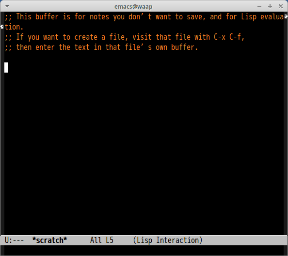

# helm-matsuya

[matsuya generator](https://github.com/toshia/matsuya-generator-ruby) command with helm interface

## Image

## Command

#### `M-x helm-matsuya`

Generate matsuya menu with generator.

Actions are
- Search menu
- Insert menu
